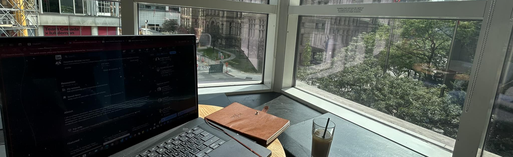

# Hi there, I'm Haeytham 👋  
### Frontend Developer | IoT Technologist | Full-Stack Enthusiast | WordPress Developer

Welcome to my GitHub profile! I'm passionate about creating seamless digital experiences — from responsive UIs to full-stack applications and IoT-powered systems. Whether it’s building modern websites, connecting sensors to the web, or developing WordPress solutions — I love bridging ideas with technology.

---

## 🧰 Toolbox

---

## 🚀 Technical Expertise

### **Frontend**

### **Backend & CMS**

### **IoT & Embedded**

---

## 💼 Featured Projects

### **SpaceX Launch Tracker**

- Real-time data from SpaceX API
- Responsive layout using Bootstrap & Axios

### **Modern Café Website**

- SSR/SSG support with dynamic pages
- Leaflet Maps & ReactPlayer integration

### **Bakery Platform**

- E-commerce experience with Vue + Vite
- Responsive product catalog & checkout

### **IoT Sensor Dashboard**
- Real-time sensor data (LabJack + Flask)
- React frontend visualized with Chart.js
- RESTful API + Socket.io communication

### **WordPress Custom Theme**
- Built custom theme from scratch
- ACF integration with SCSS styling
- Fully responsive and lightweight performance

---

## 📚 Education & Credentials

### **George Brown College** (2024–Present)  
🎓 Web Development – Front-End Design (Postgraduate)

### **Seneca Polytechnic** (2018–2024)  
🎓 Computer Engineering Technology Advanced Diploma  
🎓 Web Programming & Development Certificate

---

## 🌱 Current Focus

- Web Accessibility (WCAG Standards)
- Full-Stack API Development
- IoT-to-Web Integration using MQTT & WebSockets
- Custom WordPress Themes & REST API Headless CMS
- Performance Optimization in React/Vue apps

---

## 🤝 Let's Connect

---

## 📊 GitHub Activity & Stats

---
⌚ Last updated: May 13, 2025
